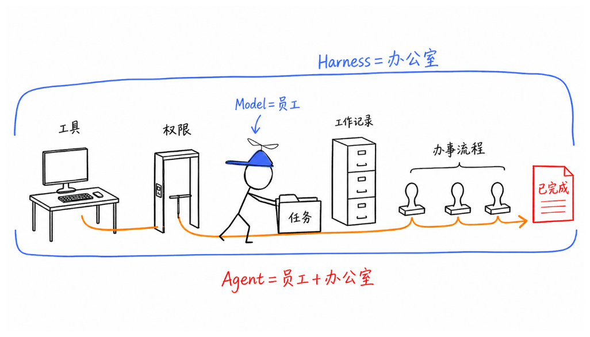
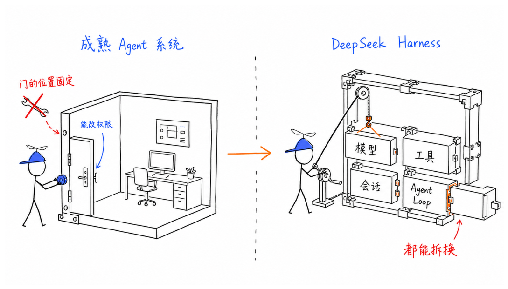
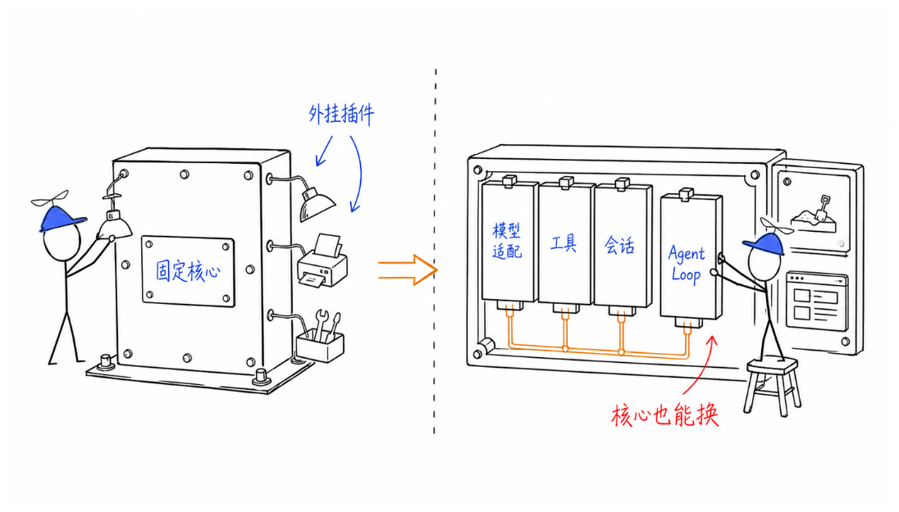
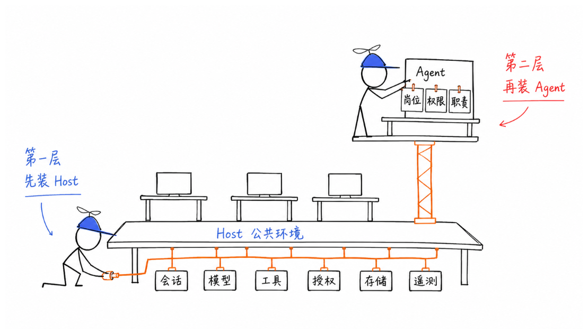
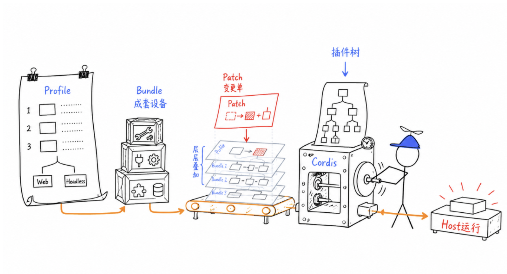
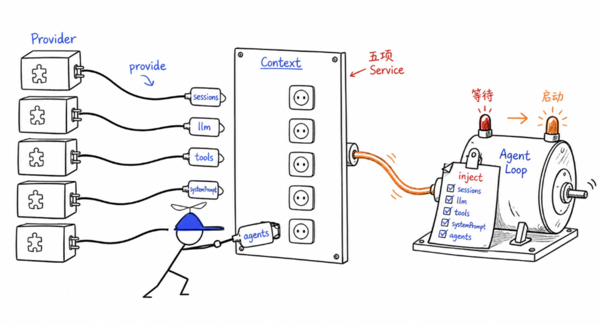
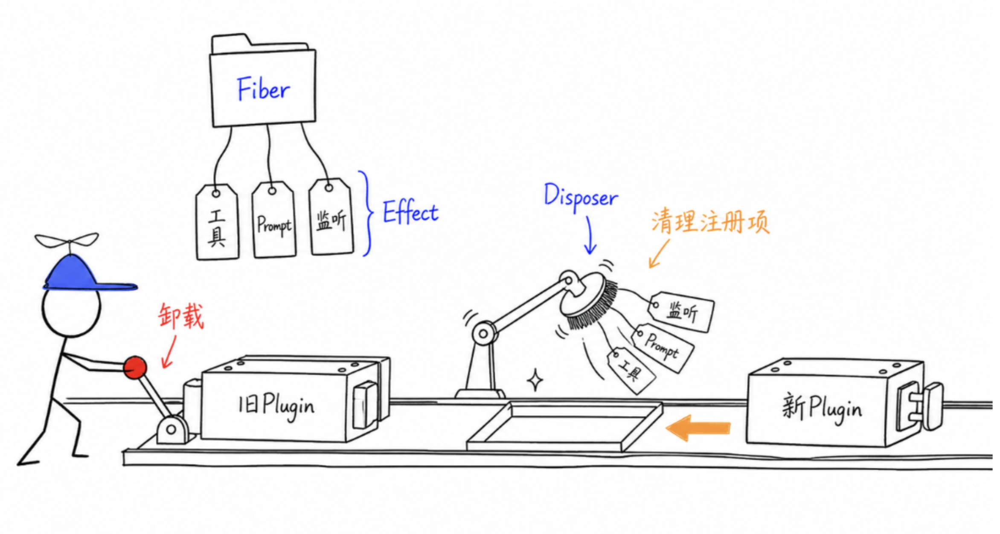
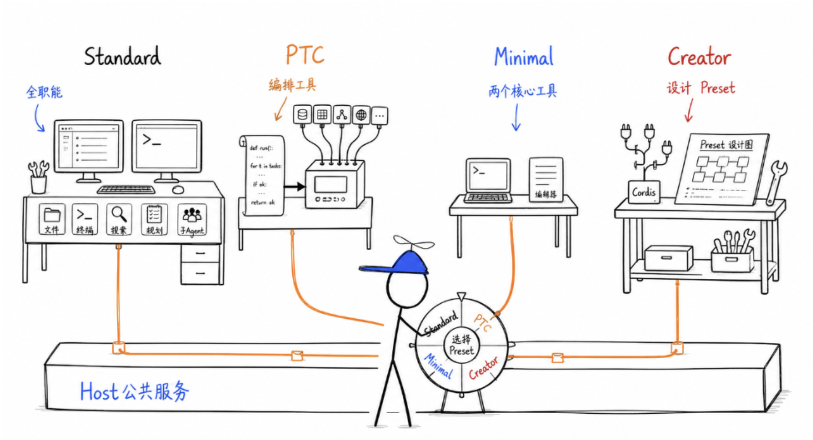
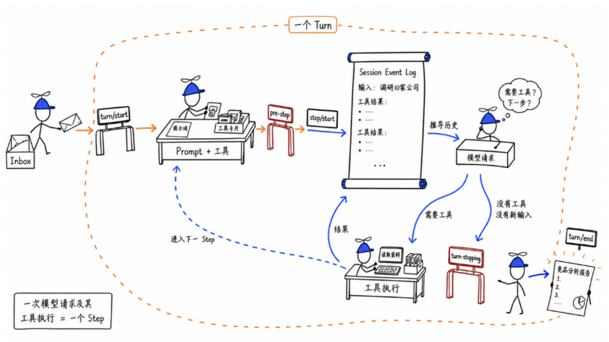
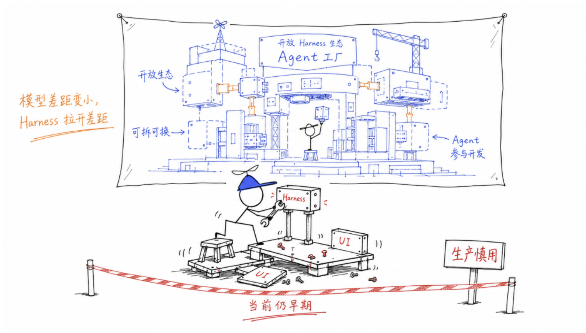

# DeepSeek Harness 产品机制与运行逻辑

## Brief

本文从产品机制出发，说明 DeepSeek Harness 与常见 Harness 的结构差异、Everything is a Plugin 的含义、Host 与 Agent 的两层装配过程，以及任务在 Agent Loop 中的完整流转。文章保留“员工与办公室”的类比，帮助理解开放式 Agent Harness 的架构、能力边界与当前成熟度。

## 一、DeepSeek Harness 与常见 Harness 的结构差异

Agent 可以理解为模型与 Harness 的组合。模型承担推理和决策，Harness 负责把这些决策转化为可执行的行动。沿用“员工与办公室”的类比，模型相当于员工，Harness 相当于工作环境。计算设备界定可用工具，文件系统保存过程记录，权限体系约束访问范围，工作流规定任务从接收走向完成的方式。

Claude Agent SDK 及其他成熟的 Agent 产品，通常已经提供较为完整的工作环境。使用者可以配置模型、工具、权限和工作流，但系统的内部层次、启动顺序与可替换范围，多由产品预先确定。它们更接近一间已经装修完成的办公室。使用者可以调整门禁权限，却很难改变原有结构。

DeepSeek Harness 采用了更开放的装配方式。模型接入、工具、会话存储和 Agent Loop 都可以替换，开发者能够根据任务需要重新组合运行环境。

DeepSeek Harness 的主要价值由此显现。它提供的是一套组织 Agent 能力的装配机制，固定配置只是其中一种结果。

## 二、Everything is a Plugin 的含义

Everything is a Plugin 是 DeepSeek Harness 的基本设计原则。普通插件体系通常保留一个相对固定的核心，插件主要用于扩展外围功能。DeepSeek Harness 将插件边界进一步推进到运行机制内部，以下部分都可以由插件提供。

- 模型适配器
- 工具注册与执行机制
- 会话记录机制
- 沙箱、调度、界面、Skills 和子 Agent 等能力
- 作为运行核心的 Agent Loop

## 三、Host 与 Agent 的两层装配

DeepSeek Harness 的装配分为两个层次。第一层构建进程共享的 Host，第二层为具体 Agent 配置专属能力。

1. **第一层负责装配 Host。** Host 是整个进程共享的运行环境，承载会话、模型、工具、授权、存储和遥测等公共服务。沿用办公室的类比，它相当于整套办公环境中的水电、网络、门禁、会议室和档案系统。
2. **第二层负责装配 Agent。** 这一层确定具体 Agent 的岗位、职责与权限。Host 由 Profile、Bundle 和 Patch 共同描述，再由 Cordis 将这些配置装配成可运行的插件树。

### Profile 的职责

Profile 是一套具名的 Host 组合方案。它决定系统采用哪些模型和工具，工作记录保存在哪里，是否提供浏览器界面，使用哪些安全规则，以及系统以何种方式运行。它相当于一份完整的装修方案。

官方提供 `web` 和 `headless` 两种 Profile。

- `web` 会随浏览器界面启动，适合需要人工观察和操作的场景。
- `headless` 不提供 Web 界面，接收任务后完成执行并保存结果，适合脚本和自动化流程。开发者也可以创建自己的 Profile。

### Bundle 的职责

Bundle 是一组可复用的能力包。它把经常共同出现的插件和配置组合起来，形成能够重复引用的功能单元。研究类 Bundle 可以包含资料检索与整理能力，代码审查类 Bundle 可以包含代码读取和测试能力。新的 Agent 只需引用相应 Bundle，无需逐个连接其中的插件。

一个 Profile 可以叠加多个 Bundle。Profile 描述整套运行方案，Bundle 管理经常共同使用的一组能力。

### Patch 的职责

Patch 用于记录局部配置变更。更换模型、关闭工具或临时增加插件时，可以通过 Patch 修改现有配置，无需重新组装 Bundle。

Profile、Bundle 和 Patch 依次叠加，最终形成完整的插件树。该结构声明系统需要加载哪些能力，Cordis 负责处理插件之间的协作、启动和运行。

### Cordis 的作用

Cordis 是插件运行时与生命周期管理器。它不直接执行 Agent 任务。它负责插件的装配、协作、替换与退出。

Cordis 所强调的时空可组合性包含两个方面。

- **空间可组合**处理插件之间的依赖关系。
- **时间可组合**处理插件卸载后的清理与替换。

### 空间可组合性

空间可组合性的基础是 Context、Provider 与 Inject。一个最小的 Agent Loop 通常依赖以下五类服务。

- Session Plugin 提供会话记录服务
- LLM Plugin 提供模型调用服务
- Tools Plugin 提供工具注册与执行服务
- System Prompt Plugin 提供提示词组装服务
- Agent Plugin 提供 Agent 注册与管理服务

插件启动后，会通过 `provide` 将服务登记到当前 Context。Session Plugin 登记 `sessions`，LLM Plugin 登记 `llm`，Tools Plugin 登记 `tools`。

Context 负责记录当前环境已经提供的服务。Agent Loop 通过 `inject` 声明运行前所需的 `agents`、`sessions`、`llm`、`tools` 和 `systemPrompt`。Cordis 检查 Context，只有依赖全部满足，Agent Loop 才会启动。使用方只依赖服务接口，无需了解服务由哪个插件提供。这与标准插座的作用相似，设备只需要符合接口，不必关心电力来自哪里。

### 时间可组合

时间可组合关注插件退出后的系统状态。插件可能注册工具、补充 Prompt、监听事件或启动文件监听器。卸载插件时，这些改动也必须同步撤销，否则旧能力会继续留在系统中，并与新插件发生冲突。

Cordis 通过 Fiber、Effect 和 Disposer 管理这一过程。

- Fiber 保存插件的生命周期状态，记录插件是否已经加载、正在运行或已经卸载。
- Effect 表示插件对外部环境产生的改动。
- Disposer 定义这些改动在卸载时应如何撤销。

以文件读取插件为例，旧插件退出时，它注册的工具、Prompt 和事件监听都会被清理。清理完成后，新插件才能注册自己的实现。空间可组合性保证依赖能够替换，时间可组合性保证替换过程不会遗留旧状态。

完成这一步以后，Host 已经具备运行所需的公共服务。Profile 选择整体方案，Bundle 提供可复用的配置层，Patch 记录局部修改，Cordis 根据依赖关系和生命周期运行整棵插件树。

### Agent Preset 的能力配置

Host 提供共享服务，Agent Preset 决定具体 Agent 可以使用哪些能力。不同会话可以选择不同 Preset。同一套 Host 因而能够支持职责和权限各不相同的 Agent。

官方目前主要提供四种模式。

- **Standard** 提供文件编辑、Shell、搜索、Skills、规划、目标、子 Agent 和工作流等完整能力。
- **PTC** 保留 Standard 的大部分能力，并通过 Code Mode SDK 向模型提供工具。模型可以把多次工具调用编排成程序，减少逐次交互，适合批量操作。
- **Minimal** 仅保留持久 Bash 和文件编辑器，并采用更精简的 Prompt，适合观察模型在外部辅助较少时的表现。
- **Creator** 在 Standard 的基础上增加 Cordis 环境检查、插件试验和 Agent Preset 创建能力。

经过 Host 与 Agent Preset 两层装配以后，具体 Agent 才具备处理任务所需的运行环境与专属能力。

## 四、任务在 Agent Loop 中的运行过程

以“调研十家竞品公司并输出竞品分析报告”为例，一个任务会依次经过以下环节。

1. **进入 Inbox。** 用户消息首先进入 Agent 的任务收件箱。
2. **开启 Turn。** 消息唤醒 Agent Loop，系统随即开启一个 Turn。Turn 表示一轮完整任务，从用户提交输入开始，直至 Agent 完成、失败或停止。
3. **执行 Step。** Turn 由多个 Step 构成。一次模型请求及其触发的工具执行共同组成一个 Step。例如，模型首次查看目录构成一个 Step，读取文件后再次判断构成下一个 Step。
4. **领取输入并组装 Prompt。** Agent Loop 从 Inbox 中领取输入，为当前 Step 组装 System Prompt 与工具列表。插件、权限和 Agent 可用工具都可能发生变化，因此系统会在每次请求模型前重新组装，让模型始终看到最新状态。
5. **执行前置检查。** 组装完成的输入会经过 `agent/pre-step`。插件可以在这里补充上下文、修改输入或拒绝当前 Step。
6. **写入日志。** 检查通过后，系统写入 `step/start`，将真正进入当前步骤的用户消息记录到 Session Event Log。模型需要看到的历史也会从这份日志中推导出来。
7. **请求模型。** 历史准备完成后，系统通过 `agent/request` 发起请求，模型经由 `llm/stream` 流式返回内容。
8. **形成模型决策。** 模型读取任务后，可能先调用 `read_file` 查看已有资料。
9. **让结果回流。** 工具执行结果写入 Session Log，再返回给模型，模型据此决定后续动作。
10. **结束 Turn。** 模型停止调用工具且 Inbox 中没有新输入时，系统会在 `agent/turn-stopping` 执行最后检查。确认没有后续事项后，系统写入 `turn/end`，本轮任务随之结束。

## 结语

随着模型能力逐步接近，Harness 的可用性会成为区分 Agent 产品的重要因素。DeepSeek Harness 试图通过开放架构降低开发者对单一 Harness 的依赖，并让 Agent 有机会参与自身能力的扩展。

这套设计目前仍处于早期阶段。官方已经说明，后续版本可能进行不兼容旧版本的重构。它的架构设想领先于当前产品成熟度，现有插件实践也多集中在界面等较浅层的改造。现阶段更适合作为架构实验和原型研究对象。若用于生产环境，还需要进一步评估版本兼容性、插件生态、权限治理与运行稳定性。

